Homework 2: ggplot
================
2019-03-08

``` r
library(tidyverse)
```

    ## ── Attaching packages ──────────────────────────────────────────────────────────────────────────────────────────────────── tidyverse 1.2.1 ──

    ## ✔ ggplot2 3.1.0       ✔ purrr   0.3.1  
    ## ✔ tibble  2.0.1       ✔ dplyr   0.8.0.1
    ## ✔ tidyr   0.8.3       ✔ stringr 1.4.0  
    ## ✔ readr   1.3.1       ✔ forcats 0.4.0

    ## ── Conflicts ─────────────────────────────────────────────────────────────────────────────────────────────────────── tidyverse_conflicts() ──
    ## ✖ dplyr::filter() masks stats::filter()
    ## ✖ dplyr::lag()    masks stats::lag()

  - Take the first faceted plot in this section:

<!-- end list -->

``` r
ggplot(data = mpg) + 
  geom_point(mapping = aes(x = displ, y = hwy)) + 
  facet_wrap(~ class, nrow = 2)
```

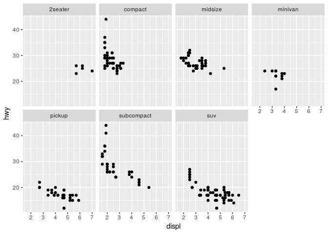<!-- -->

What are the advantages to using faceting instead of the colour
aesthetic? What are the disadvantages? How might the balance change if
you had a larger dataset?

It is difficult to resolve more than a dozen or so discrete colours, but
we can have a larger number of facets than that. On the other hand,
facets can be harder to read at a glance, or if the cells being compared
aren’t lined up in the required dimension. So in a situation like this,
colours are probably better, but if we had more classes, or wanted to
use colour for a different variable, facets would come into their own.

  - Recreate the R code necessary to generate the following
graphs.

<!-- end list -->

``` r
knitr::include_graphics(paste0("plots/fig", 1:6, ".png"))
```


``` r
ggplot(data = mpg, mapping = aes(x = displ, y = hwy)) + 
  geom_point() + 
  geom_smooth(se = FALSE)
```

    ## `geom_smooth()` using method = 'loess' and formula 'y ~ x'

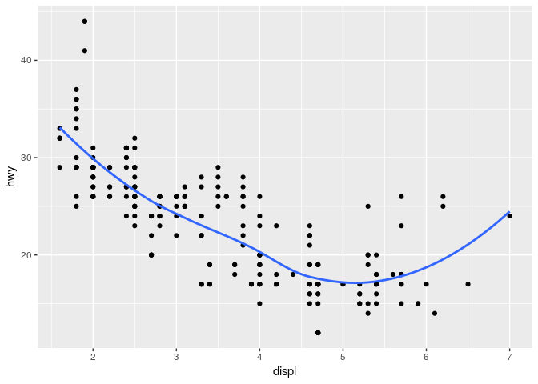<!-- -->

``` r
ggplot(data = mpg, mapping = aes(x = displ, y = hwy)) + 
  geom_point() + 
  geom_smooth(aes(group = drv), se = FALSE)
```

    ## `geom_smooth()` using method = 'loess' and formula 'y ~ x'

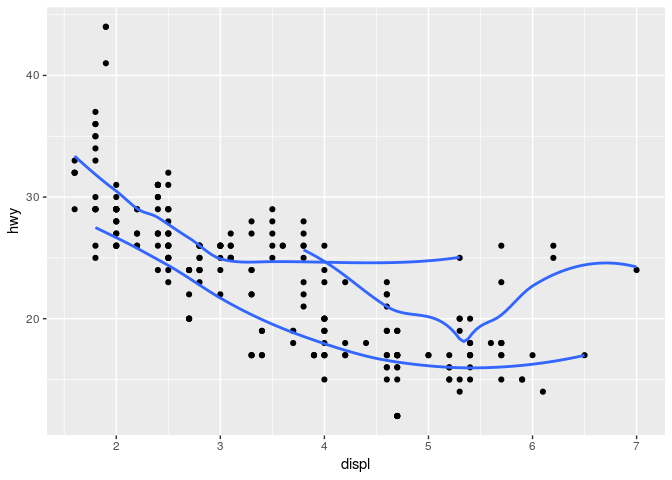<!-- -->

``` r
ggplot(data = mpg, mapping = aes(x = displ, y = hwy, color = drv)) + 
  geom_point() + 
  geom_smooth(se = FALSE)
```

    ## `geom_smooth()` using method = 'loess' and formula 'y ~ x'

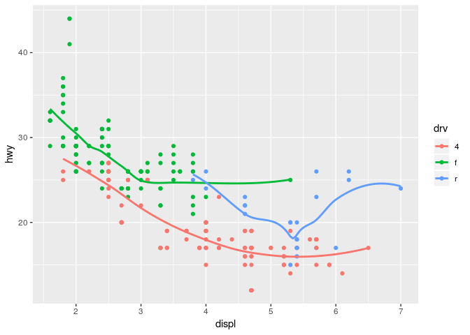<!-- -->

``` r
ggplot(data = mpg) + 
  geom_smooth(mapping = aes(x = displ, y = hwy), se = FALSE) +
  geom_point(mapping = aes(x = displ, y = hwy, color = drv))
```

    ## `geom_smooth()` using method = 'loess' and formula 'y ~ x'

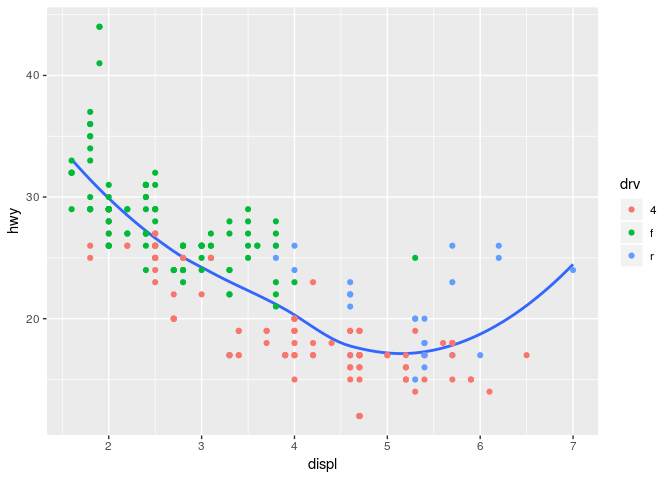<!-- -->

``` r
ggplot(data = mpg, mapping = aes(x = displ, y = hwy)) + 
  geom_smooth(aes(linetype = drv), se = FALSE) +
  geom_point(aes(color = drv))
```

    ## `geom_smooth()` using method = 'loess' and formula 'y ~ x'

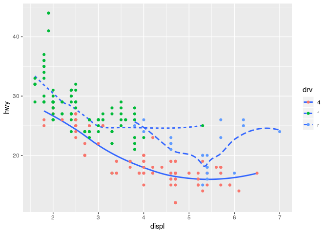<!-- -->

``` r
ggplot(data = mpg, mapping = aes(x = displ, y = hwy)) + 
  geom_point(size = 4, colour = "white") + geom_point(aes(colour = drv))
```

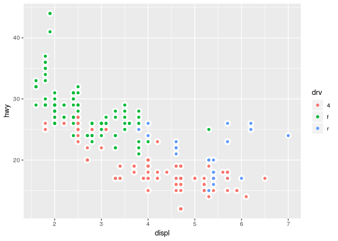<!-- -->

  - Most geoms and stats come in pairs that are almost always used in
    concert. Read through the documentation and geom\_bar() and
    stat\_count() geom\_bin2d() and stat\_bin\_2d() geom\_boxplot() and
    stat\_boxplot() geom\_contour() and stat\_contour() geom\_count()
    and stat\_sum() geom\_density() and stat\_density()
    geom\_density\_2d() and stat\_density\_2d() geom\_hex() and
    stat\_hex() geom\_freqpoly() and stat\_bin() geom\_histogram() and
    stat\_bin() geom\_qq\_line() and stat\_qq\_line() geom\_qq() and
    stat\_qq() geom\_quantile() and stat\_quantile() geom\_smooth() and
    stat\_smooth() geom\_violin() and stat\_violin() geom\_sf() and
    stat\_sf()

  - Compare and contrast geom\_jitter() with geom\_count(). geom\_jitter
    randomly moves the points to stop them overlapping. geom\_count
    deterministically counts the points at a given point and maps them
    to the size of a single point. The determinism of geom\_count makes
    it useful in discrete situations, but it does not work when the
    points are overlapping but not in exactly the same place.

  - What does the plot below tell you about the relationship between
    city and highway mpg (fuel consumption)? Why is coord\_fixed()
    important? What does geom\_abline() do? geom\_abline is used to plot
    lines defined by slope (a) and intercept (b) parameters. Used with
    no arguments, like here, it will plot a line with slope 1 and
    intercept 0, so passing through the origin at 45 degrees.
    coord\_fixed is important because x and y have the same units, so we
    want to maintain the slope of the line, and see that city mileage is
    worse than highway, but more importantly that this is better
    explained by a constant offset than a multiplicative factor.

<!-- end list -->

``` r
ggplot(data = mpg, mapping = aes(x = cty, y = hwy)) +
  geom_point() + 
  geom_abline() +
  coord_fixed()
```

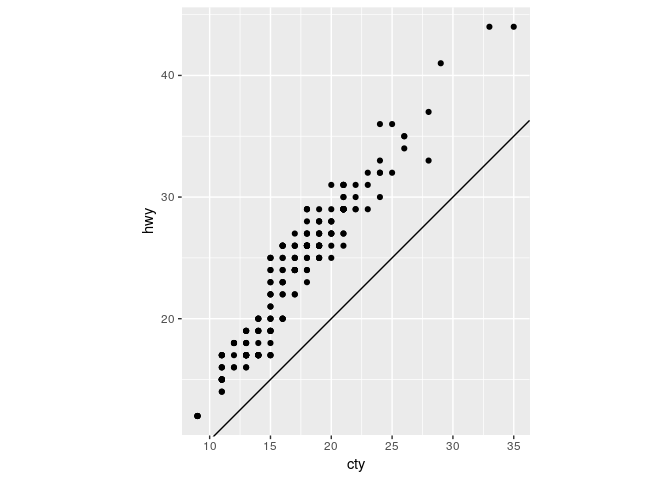<!-- -->

  - What is the default geom associated with stat\_summary()?
    geom\_pointrange().

<!-- end list -->

``` r
ggplot(data = diamonds) + 
  stat_summary(
    mapping = aes(x = cut, y = depth),
    fun.ymin = min,
    fun.ymax = max,
    fun.y = median
  )
```

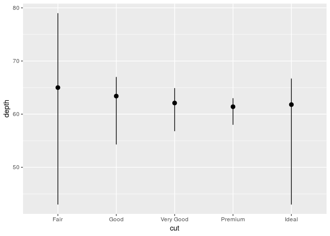<!-- -->

How could you rewrite the previous plot to use that geom function
instead of the stat function?

``` r
ggplot(diamonds) +
  geom_pointrange(
    mapping = aes(x = cut, y = depth),
    stat="summary",
    fun.ymin = min,
    fun.ymax = max,
    fun.y = median
  )
```

<!-- -->

  - What does geom\_col() do? How is it different to geom\_bar()?
    geom\_col() leaves the data as it is. geom\_bar() creates two
    variables (count and prop) and then graphs the count data on the y
    axis. With geom\_col you can plot the values of any x variable
    against any y variable.

  - What variables does stat\_smooth() compute? What parameters control
    its behaviour? stat\_smooth() computes the y, the predicted value of
    y for each x value. Also, it computes the se of that value
    predicted, together with the upper and lower bound of that point
    prediction. It can compute different methods such as lm, glm, lowess
    among others. The statistic can be controlled with the method
    argument.

  - In our proportion bar chart, we need to set group = 1. Why? In other
    words what is the problem with these two graphs? Two graphs doesn’t
    show like this anything. ..prop.. finds proportions of the groups in
    the data. If we don’t specify that we want all the data to be
    regarded as one group, then geom\_barchart we end up with each cut
    as a separate group, and if we find the proprtion of “Premium”
    diamonds that are “Premium”, the answer is 1.

<!-- end list -->

``` r
ggplot(data = diamonds) + 
  geom_bar(mapping = aes(x = cut, y = ..prop..))
```

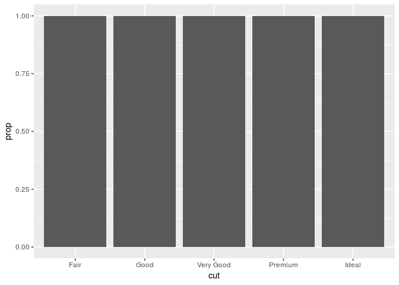<!-- -->

``` r
ggplot(data = diamonds) + 
  geom_bar(mapping = aes(x = cut, fill = color, y = ..prop..))
```

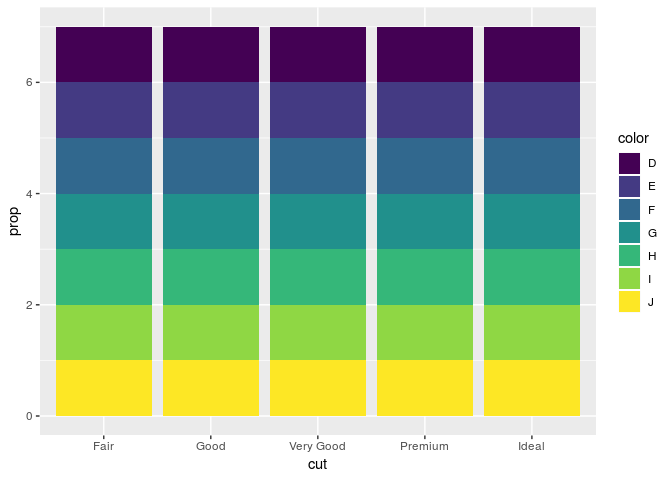<!-- -->
